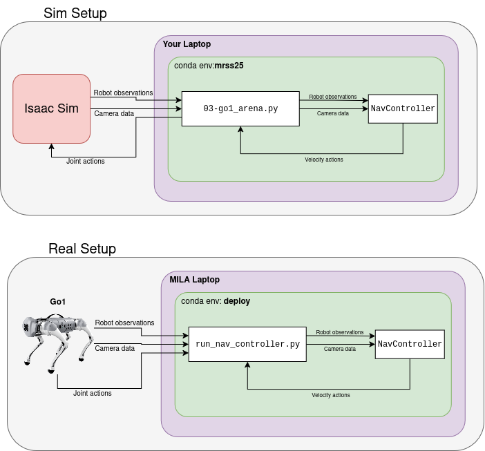

# Montreal Summer School 2025 - Go1 Locomotion Challenge

This repository contains code for the Go1 Locomotion Challenge, which involves training a Go1 robot to walk using reinforcement learning (RL). We will use:
- **Isaac Sim** [(https://github.com/isaac-sim/IsaacSim/)](https://github.com/isaac-sim/IsaacSim/) for simulation
- **Isaac Lab** [(https://github.com/isaac-sim/IsaacLab)](https://github.com/isaac-sim/IsaacLab) for the Go1 robot model
- **RSL RL library** [(https://github.com/leggedrobotics/rsl_rl/)](https://github.com/leggedrobotics/rsl_rl/) for the RL framework

## The Challenge

The core of the competition is to train a robust low-level walking policy in simulation, then perform sim-to-real transfer on an actual Unitree Go1 quadruped robot using the Isaac Lab framework.

Once that works, you'll have the opportunity to code a high-level, vision-based navigation controller to drive your robot autonomously in a simple obstacle race using monocular fisheye camera images. To make this task manageable, we will place AprilTags in the arena.

On Friday, the final challenge will evaluate your walking policy across three tiers of difficulty:

1. **No obstacles, joystick control** - Navigate a straight line to reach the goal as quickly as possible using joystick control.
2. **Obstacles, joystick control** - Same as Tier 1, but with obstacles like walls and uneven terrain in the arena.
3. **Obstacles, vision-based control** - Same as Tier 2, but without joystick control. Your robot navigates autonomously using images from a front-facing monocular fisheye camera. AprilTags with known positions are placed around the arena and near the goal, while tags with unknown positions mark large obstacles.

Good luck everyone!

## System Requirements

The main requirement is being able to run Isaac Sim and Isaac Lab. If you can successfully install and run these frameworks, your system should be compatible with this project.

**Recommended Operating System:** Ubuntu 22.04 LTS (this is what was used for testing and development)

Your system must meet Isaac Sim's [minimum hardware requirements](https://docs.isaacsim.omniverse.nvidia.com/4.5.0/installation/requirements.html#system-requirements), which include:
- NVIDIA RTX GPU (required for physics simulation)
- Sufficient RAM and storage
- Compatible NVIDIA drivers

Other Linux distributions and Windows may work but are not officially supported.

If you are not able to install the project on your own machine, MILA will provide access to some computers.

## Installation


If you encounter any installation problems, please post your questions in the Discord channel.

### 1. Isaac Sim 4.5.0

**Isaac Sim 4.5.0** simulates the Go1 robot and environment physics.

1. Ensure your PC meets the [minimum system requirements](https://docs.isaacsim.omniverse.nvidia.com/4.5.0/installation/requirements.html#system-requirements).

2. Follow the Isaac Sim Documentation to install the **Workstation Setup**: 
   [Workstation Installation](https://docs.isaacsim.omniverse.nvidia.com/4.5.0/installation/install_workstation.html#workstation-setup).

3. Test that the application starts:
   ```bash
   ./isaacsim/isaac-sim.sh
   ```

### 2. Isaac Lab

**Isaac Lab** is a modular robot learning framework built on Isaac Sim. It's used to create RL environments and control the simulation.

1. Follow the instructions to install Isaac Lab from binaries: [Isaac Lab Binaries Installation](https://isaac-sim.github.io/IsaacLab/main/source/setup/installation/binaries_installation.html).

> [!WARNING] 
> Make sure you set up the Conda environment ([Setting up the conda environment](https://isaac-sim.github.io/IsaacLab/main/source/setup/installation/binaries_installation.html#setting-up-the-conda-environment-optional)). A virtual environment is required to install the other projects.

2. Verify your installation ([Verifying the Isaac Lab installation](https://isaac-sim.github.io/IsaacLab/main/source/setup/installation/binaries_installation.html#verifying-the-isaac-lab-installation)):

   ```bash
   # With your conda environment activated, from the IsaacLab root folder
   python scripts/tutorials/00_sim/create_empty.py
   ```

> [!NOTE] 
> Isaac Lab also supports installation from `pip`. However, this has NOT been tested with this project. You can try it, but we won't be able to provide support if you follow this approach.

> [!WARNING]
> The installation script doesn't work when called from `zsh` (see [\[Bug Report\] Conda environment not being setup correctly for ZSH · Issue #703 · isaac-sim/IsaacLab](https://github.com/isaac-sim/IsaacLab/issues/703)).
> We recommend running with `bash`.
> 
> Alternatively, if you *really* want to use `zsh`:
> 1. Modify `<isaac_lab_path>/isaaclab.sh` line 19 to:
>    ```
>    export ISAACLAB_PATH="$( cd "$( dirname "$0" )" &> /dev/null && pwd )"
>    ```
> 2. Modify how `SCRIPT_DIR` is computed in `<isaac_lab_path>/_isaac_sim/setup_conda_env.sh` and `<isaac_lab_path>/_isaac_sim/setup_python_env.sh` to:
>    ```
>    # Determine the script directory
>    if [ -n "$ZSH_VERSION" ]; then
>      SCRIPT_DIR="$( cd "$( dirname "$0" )" && pwd )"
>    else
>      SCRIPT_DIR="$( cd "$( dirname "${BASH_SOURCE[0]}" )" && pwd )"
>    fi
>    ```

### 3. Go1 Challenge

Install the Go1 Challenge repository:

1. Clone the repository:
   ```bash
   git clone https://github.com/modanesh/MRSS2025-go1-challenge.git
   ```

2. Install as a Python package:
   ```bash
   # Activate your conda environment created for IsaacLab (if not already activated)
   conda activate isaaclab

   cd MRSS2025-go1-challenge

   # Install the package
   pip install -e .
   ``` 

3. Test your installation:
   ```bash
   python scripts/00-verify_installation.py
   ```

### 4. VS Code Setup (Optional)

We provide VS Code configuration templates to help you debug and run the scripts more easily.

#### Setup Instructions

1. **Copy the template files** to create your VS Code configuration:
   ```bash
   # From the project root directory
   cp .vscode/tools/settings.template.json .vscode/settings.json
   cp .vscode/tools/launch.template.json .vscode/launch.json
   ```

2. **Update Isaac Lab path** in `.vscode/settings.json`:
   - Open `.vscode/settings.json`
   - Find the `python.analysis.extraPaths` section
   - Replace `${workspaceFolder}/path/to/IsaacLab/` with your actual Isaac Lab installation path
   
   Example:
   ```json
   "python.analysis.extraPaths": [
       "/home/your_username/IsaacLab/source/isaaclab",
       "/home/your_username/IsaacLab/source/isaaclab_assets",
       "/home/your_username/IsaacLab/source/isaaclab_mimic",
       "/home/your_username/IsaacLab/source/isaaclab_rl",
       "/home/your_username/IsaacLab/source/isaaclab_tasks",
   ]
   ```

#### Features Included

**Settings Template** (`.vscode/settings.template.json`):
- Isaac Lab path configuration for IntelliSense

**Launch Template** (`.vscode/launch.template.json`):
- Pre-configured debug configurations for all main scripts:
  - `01-Train`: Train a locomotion policy for the Go1
  - `02-Play`: Test trained policies
  - `03-Teleop`: Manual control in arena
  - `04-Autonomous Nav`: Autonomous navigation
- Customizable arguments for each script

#### Usage

1. **Debugging**: Set breakpoints in your code and use `F5` or the Run/Debug panel
3. **Modify arguments**: Edit `.vscode/launch.json` to change script parameters

For more detailed VS Code setup with Isaac Lab, see the [Isaac Lab VS Code guide](https://isaac-sim.github.io/IsaacLab/main/source/overview/developer-guide/vs_code.html).

## Challenge 1 - Learn to Walk

### 1. Training a Policy

If you've followed all the steps correctly, you should have a Python environment (Conda) with Isaac Lab installed along with this project.

Navigate to the project folder and run this command to train a locomotion policy for the Go1 robot:

```bash
python scripts/01-train.py --config=config/training_params.yaml
```

The `--config` flag specifies the configuration file for training parameters. See the `config` folder for more details.

During training, you can monitor progress in the WandB dashboard. Make sure you have WandB installed and configured:

```bash
pip install wandb
```

Here are some plots you should expect to see in the WandB dashboard:

<details>
  <summary>Click to view the WandB Dashboard plot</summary>

  <p>
    
  </p>
</details>

Checkpoints will be saved under `logs/rsl_rl/<run_name>/<timestamp>`.

> [!INFO] 
> **Continue Training**
> You can continue training by loading either a run name or a path to a checkpoint:
> - To load an RSL-RL checkpoint: `--load_run 2025-07-24_13-11-02`. This loads the best policy from the run. The run must be in the RSL log directory.
> - To load a specific policy: `--checkpoint path_to_policy/policy_to_load.pt`

> [!INFO]
> **Training Configuration**
> Here are some tips to improve your policy:
> - Modify the terrain settings
> - Adjust the reward coefficients

### 2. Playing a Policy

To test the trained policy, run the following command:

```bash
python scripts/01-play.py --load_run=RUN_NAME
```

Available arguments:
- `--load_run`: Specifies the run to load (folder name where the trained policy is saved)
- `--num_envs`: Number of environments to run in parallel
- `--headless`: Runs the simulation without a GUI

You have two options to load checkpoints:
- `--load_run 2025-08-05_15-16-27`: Runs the latest policy from that run
- `--checkpoint path/to/policy/my_policy.pt`: Loads a specific policy file

> [!NOTE]
> This script also exports the policy as a `jit` file, which is necessary for loading on the robot.

> [!NOTE]
> The play version uses fewer environments (defaults to 50) and a smaller terrain to reduce memory usage. If it's still too demanding for your laptop, reduce it with `--num_envs=10`.

The script exports your policy to a `jit` file at `logs/rsl_rl/<run_name>/<timestamp>/exported/policy.pt`.

### 3. Deploy

After verifying your policy works well in simulation, you can test it on the real robot! Send your exported policy (e.g., `policy.pt`) to your robot supervisor.

## Challenge 2 - Navigate Obstacles
Train a policy that performs well on uneven terrain and across obstacles.

You can test your policy's performance in simulation by changing the terrain level. The terrain configuration is defined in [`go1_challenge.isaaclab_tasks.go1_locomotion.go1_locomotion_env_cfg.ROUGH_TERRAINS_CFG`](go1_challenge/isaaclab_tasks/go1_locomotion/go1_locomotion_env_cfg.py). Try changing the proportions of different difficulties in the configuration file (under [`env.terrain.terrain_generator.sub_terrains`](config/training_params.yaml)).

You can also test your policy in the arena with:
```bash
python scripts/03-go1_arena.py --teleop --level 1 --policy logs/rsl_rl/go1_locomotion/2025-08-05_15-16-27_go1_locomotion/exported/policy.pt
```

Robot controls:
- **Arrow keys**: Linear velocity
- **Z & X**: Yaw rotation
- **R**: Reset
- **Q**: Close simulation

There are three levels of increasing difficulty:
- 1: No obstacles, flat ground
- 2: Obstacles, flat ground
- 3: Obstacles, rough ground

The level can be specified via the `--level` arg.  


## Challenge 3 - Vision-Based Navigation

Your doggo is now hungry and wants to reach its food bowl! Your final task is to implement a navigation controller that will guide the robot to its goal autonomously using vision-based localization.

You can start the challenge with:
```bash
python scripts/03-go1_arena.py --level 2 --policy logs/rsl_rl/go1_locomotion/2025-08-05_15-16-27_go1_locomotion/exported/policy.pt
```
(same as before, but without the `--teleop` flag).

The levels are the same as for the previous challenge:
- **Level 1**: No obstacles, flat ground
- **Level 2**: Obstacles, flat ground  
- **Level 3**: Obstacles, rough ground

### The Navigation Controller

The navigation system is implemented in [`go1_challenge/navigation/nav_controller.py`](go1_challenge/navigation/nav_controller.py). This class handles:
- AprilTag detection and pose estimation from camera images
- Robot localization using visual landmarks
- Path planning and obstacle avoidance
- Velocity command generation

#### Key Functions to Implement

You need to implement the following core methods marked with `@MRSS25`:

##### 1. `update(self, observations: dict) -> None`
**Purpose**: Update the robot's internal state based on sensor observations.

**Available observations**:
- `camera_rgb`: RGB camera image (H×W×3) - your primary sensor for localization
- `camera_distance`: Distance to camera in meters (HxWx1)
- `base_ang_vel`: Robot angular velocity [roll_rate, pitch_rate, yaw_rate]
- `projected_gravity`: Gravity vector in body frame (for orientation estimation)
- `velocity_commands`: Current velocity commands (3,) array [vx, vy, wz]
- `joint_pos`: Joint positions (12,) array
- `joint_vel`: Joint velocities (12,) array
- `actions`: Last action taken (12,) array
- `goal_position`: Target position in world coordinates [x, y]
- `robot_pose`: Ground truth pose [x, y, yaw] (debug only - not available on real robot)


##### 2. `get_command(self) -> tuple[float, float, float]`
**Purpose**: Generate velocity commands to drive the robot toward the goal.

**Returns**: Tuple of `(lin_vel_x, lin_vel_y, ang_vel_z)` in range [-1, 1]


##### 3. `reset(self) -> None`
**Purpose**: Reset the controller state when the environment resets.

#### AprilTag System

The arena contains AprilTags for localization:
- **Known position tags**: Placed at fixed locations around the arena perimeter and near the goal
- **Obstacle tags**: Placed on movable obstacles (unknown positions)

The `detect_apriltags()` method is already implemented and returns:
```python
{
    tag_id: {
        "pose": {
            "position": [x, y, z],  # Position in camera frame
            "rotation_matrix": [[...]]  # 3x3 rotation matrix
        },
        "distance": float,
        "confidence": float
    }
}
```

How you use the landmarks positions is up to you!

#### Implementation Tips

1. **Localization Strategy**:
   - Use known AprilTags as landmarks for SLAM or Monte Carlo localization
   - Combine visual odometry with tag observations
   - Consider implementing a particle filter or Extended Kalman Filter

2. **Navigation Strategy**:
   - Implement reactive navigation (potential fields, bug algorithms)
   - Or use planning-based approaches (A*, RRT)
   - Use obstacle tags for dynamic obstacle avoidance
   - Could RL be applied here?

3. **Camera Calibration**:
   - Camera intrinsics are provided: `(fx, fy, cx, cy)`
   - Tag size is 0.16m (side length of black square)
   - The parameters for the real camera will be different. We are going to provide them later

4. **Debugging**:
   - Use `visualize=True` in `detect_apriltags()` to save detection images
   - Print debug information in the `update()` method
   - Use ground truth pose (available in simulation) to validate your estimates

> [!TIP] 
> Trying to use the same policy for all the robots? Your `NavController.get_command` should then output the joint positions (12 dim) as actions instead of the target velocities. 
> You'll have to modify `03-go1_arena.py` to send those directly to the `env`. Feel free to ask if you are not sure where to start. 

#### Deployment to Real Robot
When you are ready to test your policy, send your `nav_controller.py` to your robot supervisor. They'll run the script on the MILA laptop.

> [!NOTE]
> Because the script will run in another conda environment, ask the organizers before installing more Python packages.




#### Evaluation Criteria

Your navigation controller will be evaluated on:
- **Accuracy**: How close does the robot get to the goal?
- **Efficiency**: How quickly does it reach the goal?
- **Robustness**: Does it handle obstacles and localization failures gracefully?

Important comments in the code are tagged with `@MRSS25` to help you identify what needs to be implemented.

Good luck with your autonomous navigation system!

## Code Overview

### Project Structure
```
├── config
├── go1_challenge
│   ├── arena_assets
│   ├── isaaclab_tasks
│   ├── navigation
│   ├── utils
│   └── scripts
└── scripts
    ├── camera
    ├── rsl_rl
    └── skrl
```

- `config`: YAML configuration files for environment and training parameters
- `go1_challenge`: Implementation of the Gym environment
- `scripts`: Executable scripts for training, playing, and testing

### Go1_challenge - Python Package

#### `arena_assets`
Assets and scripts for generating the competition arena.

#### `isaaclab_tasks`
Isaac Lab environments implemented as manager-based environments. These are modifications of the [Isaac-Velocity-Rough-Unitree-Go1-v0](https://github.com/isaac-sim/IsaacLab/blob/main/source/isaaclab_tasks/isaaclab_tasks/manager_based/locomotion/velocity/config/go1/rough_env_cfg.py) environment.

- `go1_locomotion_env_cfg.py`: Environment implementation using configuration files
- `go1_challenge_env_cfg.py`: Challenge environment implementation
- `mdp`: Implementation of MDP functions including reward terms, reset conditions, and terrain difficulty
- `agents`: Configuration for the [RSL-RL](https://github.com/leggedrobotics/rsl_rl) agent
